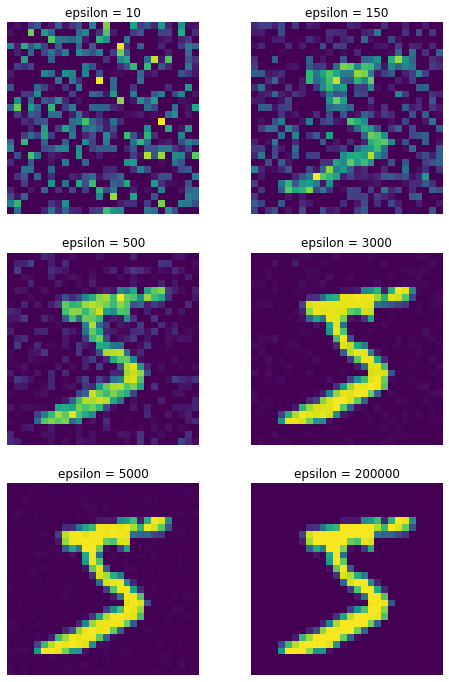

# Differentially-private neural networks through synthetic data
Repository for Data Privacy Final Project. December 2019. Investigates the performance of unsupervised clustering methods used to classify unlabeled, differentially-private MNIST data. Contributors: Sophia Hodson, Nick Hanoian and Max Green. 

We use the open source MNIST Data set which can be found at : http://yann.lecun.com/exdb/mnist/

Differentially-private input data for various values of epsilon.

## Project

This project investigates how model performance of a neural network
classifier changes when training the model on raw data versus
synthetic data. We evaluate testing performance on raw data, as this
is the most realistic scenario: one analyst builds a generalizable,
differentially private neural network to classify data, and individual
companies will use the model to classify their raw data. By asking and
exploring this question, we can better understand the power and
limitations of using machine learning on synthetic data.

## Description of Files

- `docs`: folder containing the resulting paper as well as slides used to present our findings.
- `scripts`: scripts used to noise the data and create basic models
  - `mnist_utils.py`: script which loads in the MNIST dataset
  - `local_dp_data.py`: script experimenting and visualizing different differential privacy algorithms to noise the data with
  - `neural_nets.py`: neural networks model
  - `k_means_clustering.py`: definition of unsupervised kmeans clustering model 
  - `driver.py`: driver file to run kmeans clustering algorithm
- `iic/`: folder containing code to run IIC model with local differential privacy. Original implementation from https://github.com/astirn/IIC. Our modifications to the original implementation are contained in a diff located at `iic/dp-diff.txt`.
- `figures`: figures from the paper

<!-- # Possible Approaches -->
<!-- ## Unary Encoding with Clustering -->
<!-- - convert each pixel to binary: either on or off -->
<!-- - convert each label to one hot representation -->
<!-- - use unary encoding on each example to get local synthetic dataset -->
<!-- - We hope that the noisy images are not too bad -->
<!-- - but the noisy labels are very bad and not recoverable on their own -->
<!-- - use unsupervised clustering on the examples (ignoring labels) -->
<!-- - hopefully these form good clusters -->
<!-- - then look at all of the noisy labels within each cluster, and determine the most likely label for that cluster (we are thinking that this will be very evident because each cluster should have a LOT of examples in it, so averaging is on our side) -->
<!-- - Then we label the clusters, and we have a differentially private model to take an image and classify it -->
<!-- - look at performance -->

<!-- ## Marginals and Convolutional Neural Net -->
<!-- - build 2-way marginals between each pixel and the label -->
<!-- - build 1-way marginal for the label -->
<!-- - build synthetic dataset by drawing a label from the 1-way marginal, then draw a pixel value from each 2-way marginal, given that label -->
<!-- - train CNN classify the data -->
<!-- - look at performance -->
